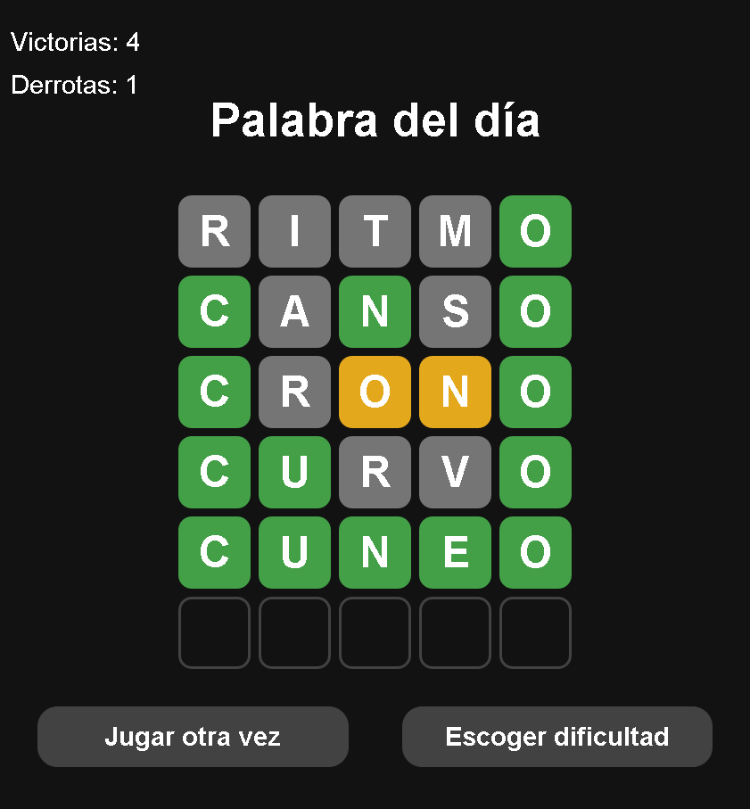

# Wordle

La idea de este proyecto es crear una versión del juego [Wordle](https://lapalabradeldia.com/) usando HTML, CSS y JavaScript. El proyecto está construido con [Vite](https://vitejs.dev/), un bundler que permite crear proyectos web modernos con una configuración mínima.

## Vista previa



## Comenzando 

1. Clona este repositorio en tu máquina local o descargar la carpeta comprimida del proyecto:

   ```bash
   git clone https://github.com/drifterDev/wordle.git
   ```

2. Abre la carpeta del proyecto `entrega` en tu navegador web y comienza a jugar.

### Prerrequisitos 

Antes de comenzar, asegúrate de tener instalado `npm` en tu sistema. Si no lo tienes instalado, puedes descargarlo e instalarlo desde [el sitio web oficial de Node.js](https://nodejs.org/).

## Construido con 

* [Vite](https://vitejs.dev/) - Bundler
* [CSS](https://developer.mozilla.org/es/docs/Web/CSS) - Lenguaje de estilos
* [JavaScript](https://developer.mozilla.org/es/docs/Web/JavaScript) - Lenguaje de programación usado

## Contribuyendo 

Aprecio cualquier sugerencia para mejorar el contenido de este proyecto. Si deseas contribuir, por favor crea un "issue" en el repositorio o contáctame directamente. Valoraré tus aportes para mejorar este repositorio.

## Autores 

* **Mateo Álvarez Murillo** [drifterDev](https://github.com/drifterDev)
* **Efrain Gomez Ramirez** [EfraGR](https://github.com/EfraGR)
* **Libardo Jose Navarro Pedrozo** [LibardoNavarro](https://github.com/LibardoNavarro)

## Licencia 

Los códigos incluidos en este proyecto están bajo la Licencia MIT. Para obtener más información, consulta el archivo [LICENSE](LICENSE) en la raíz del repositorio.
